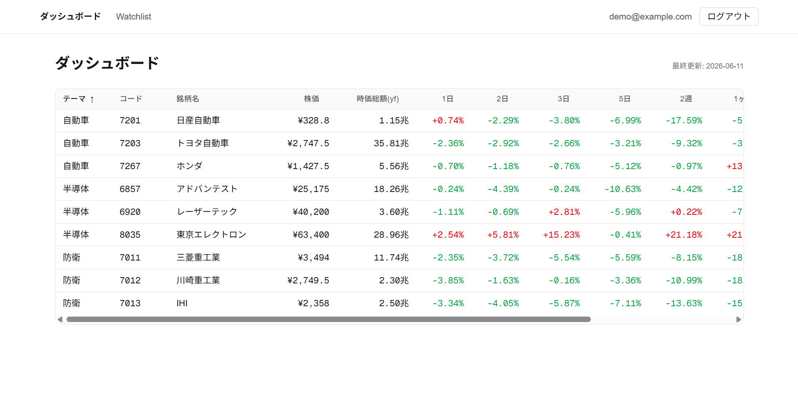
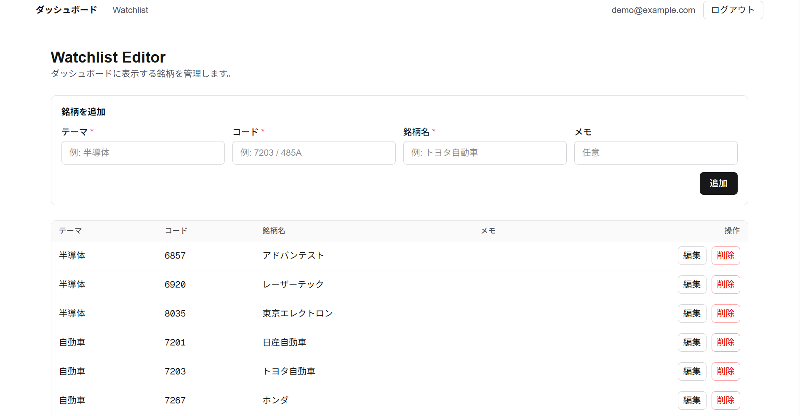

# 日本株テーマ別株式ダッシュボード

自分で分類した日本株を「テーマ別」のウォッチリストとして管理し、株価・時価総額・騰落率などの指標を 1 画面で確認できる Web アプリです。データ取得は GitHub Actions で自動化し、フロントは Vercel 上で公開しています。

🔗 **デモ: https://stock-theme-dashboard-tan.vercel.app**

> ※ デモはログインが必要です。閲覧用アカウントが必要な場合はお知らせください。
> ※ 本アプリは投資助言ではなく、銘柄監視・情報整理を目的としたツールです。

---

## スクリーンショット

<!--
  画像を docs/ フォルダに置いて、下のパスに合わせて差し替えてください。
  例: docs/dashboard.png, docs/watchlist.png
  推奨: 横幅 1200px 程度の PNG。GIF で操作の流れを見せるとより効果的です。
-->

| ダッシュボード | ウォッチリスト編集 |
|:---:|:---:|
|  |  |

---

## 特徴

- **テーマ別の銘柄管理** — 自分で定義したテーマ（カテゴリ）ごとに日本株を整理し、横断的に比較できる
- **複数指標を 1 画面に集約** — 株価・時価総額・短期/中期の騰落率（5営業日〜3か月）をソート可能なテーブルで表示
- **データ取得の自動化** — 平日 17:30 JST に GitHub Actions が yfinance で最新指標を取得し、DB へ自動反映
- **認証付きのマルチユーザー対応** — Supabase Auth でログインし、Row Level Security により各ユーザーは自分のウォッチリストのみ参照可能
- **サーバーレス構成** — Vercel + Supabase + GitHub Actions で、サーバー管理不要・低コストで運用

---

## 技術スタックと選定理由

| 領域 | 技術 | 選定理由 |
|------|------|----------|
| フロントエンド | **Next.js (App Router) / TypeScript** | Server Components でデータ取得を完結させ、クライアント JS を最小化。型安全に開発するため |
| 認証 / DB | **Supabase (Auth + Postgres)** | 認証・DB・RLS を一体で扱え、個人開発でも本番品質のアクセス制御を最短で実現できるため |
| バッチ処理 | **Python + yfinance** | 株価データ取得のエコシステムが充実しており、定期取得スクリプトを簡潔に書けるため |
| 自動化 / CI | **GitHub Actions** | cron による定期実行とシークレット管理を追加インフラなしで実現できるため |
| ホスティング | **Vercel** | Next.js との親和性が高く、Git push から自動デプロイできるため |

---

## アーキテクチャ

```text
[ブラウザ]
    ↓ HTTPS
[Vercel: Next.js + TypeScript] ─── SDK ──→ [Supabase]
                                             ├ Auth (Email/Password)
                                             └ Postgres
                                                  ↑ upsert
[GitHub Actions: Python + yfinance] ─────────────┘
   平日 17:30 JST に定期実行
```

- **Next.js (Vercel)**: ブラウザ UI。ダッシュボード表示と銘柄編集
- **Supabase**: 認証と DB（Postgres）。RLS でユーザーごとのデータを分離
- **GitHub Actions (Python)**: yfinance で株価・指標を取得し、Supabase へ書き込み

---

## こだわった点・工夫

- **権限分離によるセキュリティ設計**
  フロントは公開可能な anon key + RLS で「本人のデータのみ」アクセスを保証。書き込みを伴うバッチのみ、RLS をバイパスする service_role key を GitHub Secrets 経由で使用し、鍵の用途と露出範囲を分離しました。
- **取得失敗に強いデータパイプライン**
  yfinance は日本株のファンダメンタルデータが欠損することがあるため、欠損値を `null` として安全に扱い、1 銘柄の取得失敗が全体の処理を止めないよう設計しています。
- **運用コストゼロを目指したサーバーレス構成**
  常時起動するサーバーを持たず、定期バッチ・DB・ホスティングをすべてマネージド/無料枠中心のサービスに寄せました。

---

## 画面構成

| Path | 内容 |
|------|------|
| `/login` | Supabase Auth でログイン |
| `/` | ダッシュボード（テーマ別の株価表） |
| `/watchlist` | 銘柄の追加・編集・削除 |

---

## ディレクトリ構成

```text
stock_theme_dashboard/
├── web/                       # Next.js（Vercel デプロイ対象）
│   ├── app/                   # ルーティング・ページ
│   ├── components/            # UI コンポーネント
│   └── lib/supabase/          # Supabase クライアント
├── jobs/                      # 定期取得ジョブ（Python）
│   ├── fetch_metrics.py
│   └── requirements.txt
├── supabase/migrations/       # DB スキーマ（SQL）
│   └── 0001_init.sql
└── .github/workflows/         # GitHub Actions
    └── update-metrics.yml
```

DB スキーマ（テーブル定義・RLS ポリシー）の詳細は [`supabase/migrations/0001_init.sql`](supabase/migrations/0001_init.sql) を参照してください。

---

## ローカルでの起動

```bash
cd web
npm install
cp ../.env.example .env.local
# .env.local に Supabase の URL と anon key を設定
npm run dev
```

DB のセットアップや環境変数の一覧は、下記「セットアップ詳細」を参照してください。

<details>
<summary>セットアップ詳細</summary>

### Supabase

1. https://supabase.com で新規プロジェクトを作成
2. SQL Editor で `supabase/migrations/0001_init.sql` を実行
3. Authentication → Email でユーザーを作成
4. プロジェクトの URL / anon key / service_role key を控える

### Vercel デプロイ

1. リポジトリを GitHub へ push
2. Vercel で New Project → ルートに `web` ディレクトリを指定
3. 環境変数 `NEXT_PUBLIC_SUPABASE_URL` と `NEXT_PUBLIC_SUPABASE_ANON_KEY` を設定
4. デプロイ

### 定期取得ジョブ

GitHub Repository の Settings → Secrets で以下を設定します。

- `SUPABASE_URL`
- `SUPABASE_SERVICE_ROLE_KEY`

ワークフロー `.github/workflows/update-metrics.yml` が平日 17:30 JST に自動実行されます。手動実行も Actions タブから可能です。

### 環境変数

| 名前 | 設定場所 | 用途 |
|------|----------|------|
| `NEXT_PUBLIC_SUPABASE_URL` | Vercel / `.env.local` | フロントから接続 |
| `NEXT_PUBLIC_SUPABASE_ANON_KEY` | Vercel / `.env.local` | フロントから接続（RLS で保護） |
| `SUPABASE_URL` | GitHub Secrets | ジョブから接続 |
| `SUPABASE_SERVICE_ROLE_KEY` | GitHub Secrets | RLS を無視してジョブから書き込み |

</details>

---

## 今後の拡張案

- J-Quants API 対応によるデータ品質の向上
- 銘柄ごとの株価チャート（保存済み `stock_metrics` 履歴を使用）
- 決算発表日・適時開示の取得
- セクターごとのヒートマップ表示

---

## データソースとライセンスについて

- 株価・指標データは [yfinance](https://github.com/ranaroussi/yfinance)（Apache-2.0）を通じて Yahoo Finance から取得しています。
- これらのデータは Yahoo Finance に帰属し、その利用は Yahoo の利用規約に従います。**個人利用・学習を目的としたツール**であり、データの再配布や商用利用を意図したものではありません。
- 本リポジトリにはコードのみを含み、取得した株価データそのものは含まれていません。
